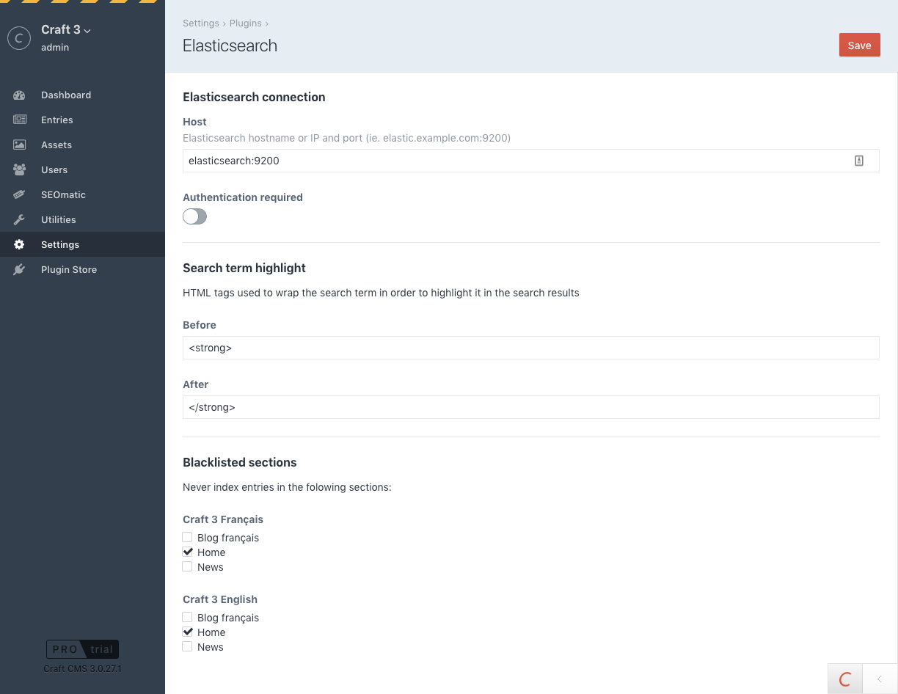

[][elastic-site]  

# Elasticsearch plugin for Craft CMS 3.x

Bring the power of Elasticsearch to your Craft 3 CMS project.




## Requirements

This plugin requires **Craft CMS 3.0.0-RC1** or later.

In order to index data, you will need an **Elasticsearch 6.0** (or later) 
instance, with the **Ingest attachment processor** plugin activated.


## Installation

### The easy way

Just install the plugin from the Craft Plugin Store.

### Using Composer

  - Install with Composer from your project directory: `composer require la-haute-societe/craft-elasticsearch`
  - In the Craft Control Panel, go to Settings → Plugins and click the **Install** button for Elasticsearch.
 

## Elasticsearch plugin Overview

Elasticsearch plugin will automatically index each entry and Craft Commerce product (if installed) on your site(s).

It will figure out the best Elasticsearch mapping for you based on your site(s)' language. 

## Supported languages

| Craft language | Elastic analyzer                | Notes                          |
| -------------- | ------------------------------- | ------------------------------ |
| ar             | arabic                          |                                |
| hy             | armenian                        |                                |
| eu             | basque                          |                                |
| bn             | bengali                         |                                |
| pt-BR          | brazilian                       |                                |
| bg             | bulgarian                       |                                |
| ca             | catalan                         |                                |
| zh             | cjk                             |                                |
| ja             | cjk                             |                                |
| ko             | cjk                             |                                |
| cs             | czech                           |                                |
| da             | danish                          |                                |
| nl             | dutch                           |                                |
| en             | english                         |                                |
| fi             | finnish                         |                                |
| fr             | french                          |                                |
| gl             | galician                        |                                |
| de             | german                          |                                |
| el             | greek                           |                                |
| hi             | hindi                           |                                |
| hu             | hungarian                       |                                |
| id             | indonesian                      |                                |
| ga             | irish                           |                                |
| it             | italian                         |                                |
| lv             | latvian                         |                                |
| lt             | lithuanian                      |                                |
| nb             | norwegian                       |                                |
| fa             | persian                         |                                |
| pt             | portuguese                      |                                |
| ro             | romanian                        |                                |
| ru             | russian                         |                                |
| es             | spanish                         |                                |
| pl             | stempel                         | analysis-stempel plugin needed |
| sv             | swedish                         |                                |
| tr             | turkish                         |                                |
| th             | thai                            |                                |


## Configuring the Elasticsearch plugin

You can configure the Elasticsearch plugin from the Craft Control Panel (some settings only), of from the 
_config/elasticsearch.php_ file in your Craft installation (all settings). If a setting is defined both in the CP and in
the configuration file, the latter takes precedence.

The [src/config.php](./src/config.php), file is a configuration template to be copied to _config/elasticsearch.php_.

> 💡 If you currently don't have an Elasticsearch server handy, here's how you can [set one up](./elasticsearch-quickstart.md).

### In both the configuration file and the CP

#### `elasticsearchEndpoint`
Type: _string_
 
The Elasticsearch instance endpoint URL (with protocol, host and port).
Ignored if `elasticsearchComponentConfig` is set.


#### `isAuthEnabled`
Type: _bool_
 
A boolean indicating whether authentication is required on the Elasticsearch instance.  
Ignored if `elasticsearchComponentConfig` is set.


#### `username`
Type: _string_
 
The username used to authenticate on the Elasticsearch instance if it's protected by 
X-Pack Security.  
Ignored if `isAuthEnabled` is set to `false` or `elasticsearchComponentConfig` is set.


#### `password`
Type: _string_
 
The password used to authenticate on the Elasticsearch instance if it's protected by
X-Pack Security.  
Ignored if `isAuthEnabled` is set to `false` or `elasticsearchComponentConfig` is set.


#### `highlight`
Type: _array_
 
The elasticsearch configuration used to highlight query results. Only `pre_tags` and 
`post_tags` are configurable in the CP, advanced config must be done in the file.  
For more options, refer to the [elasticsearch documentation][].


#### `blacklistedEntryTypes`
Type: _int[]_

An array of entry type ids of which entries should not be indexed.


### Only in the configuration file

#### `allowedIPs`
Type: _string[]_

An array of IP addresses allowed to use the Elasticsearch console commands.


#### `allowedHosts`
Type: _string[]_

An array of hostnames allowed to use the Elasticsearch console commands.


#### `contentExtractorCallback`
Type: _callable_

A callback function (`function(string $entryContent): string`) used to extract the
content to be indexed from the full HTML source of the entry's page. 

The default is to extract the HTML code between those 2 comments: 
`<!-- BEGIN elasticsearch indexed content -->` and `<!-- END elasticsearch indexed content -->`.


#### `elementContentCallback`
Type: _callable_

A callback function (`function (\craft\base\ElementInterface $element): string`) used to get the HTML content for the given element to index.

>   Note: 
>   * If this parameter is not set or null, the default Guzzle client implementation will be used to get the HTML content of the element.
>   If set, you will have to handle that part yourself.
>   * Content should be returned as HTML content in order to be correctly indexed.

#### `resultFormatterCallback`
Type: _callable_

A callback function (`function (array $formattedResult, $result): array`) used to prepare and
format the Elasticsearch result object in order to be used by the results twig view.

#### `elasticsearchComponentConfig`
Type: _array_

An associative array passed to the yii2-elasticsearch component Connection class constructor.  
All public properties of the [yii2-elasticsearch component Connection class][yii2-elasticsearch] 
can be set.  
If this is set, the `elasticsearchEndpoint`, `username`, `password` and `isAuthEnabled` settings 
will be ignored.

#### `extraFields`
Type: _array_

An associative array allowing to declare additional fields to be indexed along with the defaults ones.
See [Index additional data](#indexing-of-additional-data) for more details.
     
     
[elasticsearch documentation]: https://www.elastic.co/guide/en/elasticsearch/reference/6.x/search-request-highlighting.html
[yii2-elasticsearch]: https://www.yiiframework.com/extension/yiisoft/yii2-elasticsearch/doc/api/2.1/yii-elasticsearch-connection#properties


## Indexable content

By default, the content indexed in each entry is between the `<!-- BEGIN elasticsearch indexed content -->` 
and `<!-- END elasticsearch indexed content -->` HTML comments in the source of the entry page.

If you're using semantic HTML in your templates, then putting your `<main>` or `<article>` element between 
those comments should be ideal. 

If you need more control over what is indexed, you'll have to set up a custom `contentExtractorCallback`.


## Running a search

The search feature can be used from a frontend template file by calling the 
`craft.elasticsearch.search('Something to search')` variable.
For instance, in a template `search/index.twig`:

```twig



    <h1>{{ "Search"|t }}</h1>

    <form action="{{ url('search') }}">
        <input type="search" name="q" placeholder="Search" value="{{ craft.app.request.get('q') }}">
        <input type="submit" value="Go">
    </form>

    
        <h2>{{ "Results"|t }}</h2>

        
            <h3>{{ result.title }}</h3>
            <p>
                <small><a href="{{ result.url|raw }}">{{ result.url }}</a><br/>
                    
                        
                            {{ highlight|raw }}<br/>
                        
                    
                </small>
            </p>
            <hr>
        
    
        
            <p>
                <em>{{ "No results"|t }}</em>
            </p>
        
    

```

Each entry consists of the following attributes:

  - `id`: unique ID of the result
  - `title`: page title
  - `url`: full url to the page
  - `postDate` : date of element publication start date
  - `expiryDate` : date of element expiration date 
  - `elementHandle`: the element handle name. Can be either `entry` or `product`
  - `score`: entry result score
  - `highlights`: array of highlighted content matching the query terms
  - `rawResult`: the ElasticsearchRecord raw result object

>   Notes: 
> 
>   * To add additional attributes, see [Index additional data](#indexing-of-additional-data) for more details.
>   * To customize the Elasticsearch query, see [More complex way to get even more control](#more-complex-way-to-get-even-more-control)


## Auto indexing

The plugin automatically indexes entries and Craft Commerce products (created, updated or removed), as long as they're not in a blacklisted entry types,
or disabled.

All entries are reindexed (in the background) when plugin settings are saved.


## Elasticsearch plugin utilities

If your Elasticsearch index becomes out of sync with your sites contents, you 
can go to Utilities → Elasticsearch then click the **Reindex all** button.


## Elasticsearch plugin console commands

The plugin provides an extension to the Craft console command that lets you reindex all entries or recreate empty indexes.


### Recreate empty indexes

Remove index & create an empty one for all sites

````sh
./craft elasticsearch/elasticsearch/recreate-empty-indexes
````

Reindex all sites 

````sh
./craft elasticsearch/elasticsearch/reindex-all
````

>Notes: 
>
>* Do not forget to set `allowedIPs` and/or `allowedHosts` in the configuration file prior to calling these command lines (see "Configuring the Elasticsearch plugin" section).
>* The command will probably fail in case you don't affect a specific domain to a given site, for instance, avoid to use `@web` as a base URL.


## Indexing of additional data

### Simple way using the configuration file

To easily index additional data (elasticsearch fields), you can declare them using the `extraFields` parameter in the plugin configuration file.

Each field should be declared by using associative array with keys representing fields names and value as an associative array
to configure the field behavior:

*   `mapping` (optional): an associative array providing the elasticsearch mapping definition for the field.
    For more complex mapping, you can also use a callback (`function (\lhs\elasticsearch\records\ElasticsearchRecord $esRecord)`) to return the associative array. 
    For example:
    
    ```php
    ...
    'mapping' => function (\lhs\elasticsearch\records\ElasticsearchRecord $esRecord) {
        return [
            'type'     => 'text',
            'store'    => true,
            'analyzer' => $esRecord::siteAnalyzer()
        ];
    }
    ...
    ```
*   `highlighter` (optional): an object defining the elasticsearch highlighter behavior for the field.
    To know more about that configuration, refer to the documentation [here](https://www.elastic.co/guide/en/elasticsearch/reference/6.7/search-request-highlighting.html).
*   `value`: either a string or a callable function taking one argument of `craft\base\Element` type and returning the value of the field. 
    Second argument can be used to access the related `lhs\elasticsearch\records\ElasticsearchRecord` instance.

For example, to declare a `color` field in the configuration file, one could do:

```php
...
  'extraFields'              => [
    'color' => [
        'mapping'     => [
            'type'  => 'text',
            'store' => true
        ],
        'highlighter' => (object)[],
        'value'       => function (\craft\base\ElementInterface $element, \lhs\elasticsearch\record\ElasticsearchRecord $esRecord) {
            // $esRecord->whatEverMethod();
            return ArrayHelper::getValue($element, 'color.hex');
        }
    ]
  ...
```

### More complex way to get even more control

You can get even more control over your additional data by listening to the following events in some project module:

*   `lhs\elasticsearch\record\ElasticsearchRecord::EVENT_BEFORE_CREATE_INDEX`: That event is triggered before the Elasticsearch index is created. 
    Once you get a reference to the Elasticsearch Record instance, the following methods can be used to customise the schema as needed: 
    * `getSchema()` method can be used to get the current default Elasticsearch schema.
    * `setSchema(array $schema)` method can be used to set the customized schema
    
    For example, if you want to add a 'color' field, you could do something like:
    
    ```php
    Event::on(ElasticsearchRecord::class, ElasticsearchRecord::EVENT_BEFORE_CREATE_INDEX, function (Event $event) {
        /** @var ElasticsearchRecord $esRecord */
        $esRecord = $event->sender;
        $schema = $esRecord->getSchema();
        // Modify the original schema to add the additional field
        $schema['mappings']['elasticsearch-record']['properties']['color'] = [
            'type'  => 'text',
            'store' => true
        ];
        $esRecord->setSchema($schema);
    });
    ```
    >Note: Do not alter the following defaults properties: `title`, `url`, `elementHandle` and `content`. Also, do not alter the default `attachment` processor.
*   `lhs\elasticsearch\record\ElasticsearchRecord::EVENT_INIT`: That event can be used to add additional attributes to the ElasticsearchRecord instance to handle your indexes.
    You can use the `addAttributes(array $additionalAttributes)` to add the list of additional attributes.
    This is mandatory in order to get or set any additional fields you declared in your schema in the previous step.
    For example, if you wish to declare the 'color' field, you could do:
    
    ```php
    Event::on(ElasticsearchRecord::class, ElasticsearchRecord::EVENT_INIT, function (Event $event) {
        /** @var ElasticsearchRecord $esRecord */
        $esRecord = $event->sender;
        $esRecord->addAttributes(['color']); // Adds an additional attribute named `color`
    });
    ```
*   `lhs\elasticsearch\record\ElasticsearchRecord::EVENT_BEFORE_SAVE`: By listening to that event, you get a chance to set the value of your additional fields declared in the previous step.
    You can access the related Craft `Element` by using the `getElement()` method.
    For example, if you wish to set the value the 'color' attribute to be indexed, given that 'color' attribute corresponds to a Craft color field type, you could do:
    
    ```php
    Event::on(ElasticsearchRecord::class, ElasticsearchRecord::EVENT_BEFORE_SAVE, function (Event $event) {
        /** @var ElasticsearchRecord $esRecord */
        $esRecord = $event->sender;
        $element = $esRecord->getElement();
        // Set the color attributes value to be saved in Elasticsearch index
        $esRecord->color = ArrayHelper::getValue($element, 'color.hex');
    });
    ```
*   `lhs\elasticsearch\record\ElasticsearchRecord::EVENT_BEFORE_SEARCH`: That `lhs\elasticsearch\events\SearchEvent` event type is triggered just before a query is sent to Elasticsearch, typically when you call the `craft.elasticsearch.search('Something to search')` variable from your Twig views.
    During that event, you can use the following methods to forge your Elasticsearch query request to your needs:
    * `getQueryParams($query)` and `setQueryParams($queryParams)` can be used to alter the default Elasticsearch query parameters (see example below)
    * `getHighlightParams()` and `setHighlightParams($highlightParams)` can be used to alter the default Elasticsearch highlighter parameters (see example below)
    For example, if you wish to add the 'color' field to your query, given that 'color' attribute is a Craft color field type, you could do:
    
        ```php
        Event::on(ElasticsearchRecord::class, ElasticsearchRecord::EVENT_BEFORE_SEARCH, function (SearchEvent $event) {
            /** @var ElasticsearchRecord $esRecord */
            $esRecord = $event->sender;
            $query = $event->query;
            // Customise the query params
            $queryParams = $esRecord->getQueryParams($query);
            $queryParams['bool']['must'][0]['multi_match']['fields'] = ArrayHelper::merge($queryParams['bool']['must'][0]['multi_match']['fields'], ['color']);
            $esRecord->setQueryParams($queryParams);
            // Customise the highlighter params
            $highlightParams = $esRecord->getHighlightParams();
            $highlightParams['fields'] = ArrayHelper::merge($highlightParams['fields'], ['color' => (object)[]]);
            $esRecord->setHighlightParams($highlightParams);
        });
        ```
    >Note: By using the `resultFormatterCallback` configuration callback property, you can also add the related results accessible to your Twig page search results. 
    > 
    >For example, to add the 'color' field result you could do:
    >
    >```php
    > ...
    >'resultFormatterCallback'  => function (array $formattedResult, $result) {
    >    $formattedResult['color'] = $result->color;
    >    return $formattedResult;
    >}
    >...
    >```

## Tips

### Enable fuzziness

As of the other search query parameters, you can set fuzziness by altering default search query as follow:

```php
Event::on(ElasticsearchRecord::class, ElasticsearchRecord::EVENT_BEFORE_SEARCH, function (SearchEvent $event) {
    /** @var ElasticsearchRecord $esRecord */
    $esRecord = $event->sender;
    $query = $event->query;
    // Customise the query params
    $queryParams = $esRecord->getQueryParams($query);
    $queryParams['bool']['must'][0]['multi_match']['fuzziness'] = 'AUTO' // Adjust value to your needs here
    $esRecord->setQueryParams($queryParams);
});
```

## About yii2-elasticsearch library

At the time of the release of this plugin, no stable 2.1 version of the `yiisoft/yii2-elasticsearch` was released yet. However, that version is mandatory in order to connect to Elasticsearch instances 5 or upper.

To simplify the installation process, a `la-haute-societe/yii2-elasticsearch` fork was made and flagged as stable. Please, note that **this fork was tested and intended to work with this plugin only**.


## Troubleshooting

- When saving the settings, if you get a `Could not connect to the Elasticsearch instance at http://somedomain:9200.` `Please check the endpoint URL and authentication settings.` error :
	- If you are using an external Elasticsearch instance, check: 
		- that the instance is running 
		- the domain name/IP address and ports are correct
		- your firewall settings allow access to the server and port
	- If you are using a docker-compose setup, check:
		- that your containers are running correctly once the `docker-compose up` has been executed. Execute a `docker ps` command to see if the containers appear in the list. If they are not, chances are there are some issues preventing the containers from starting and you should check those errors in the first place.
		- that you can access the instance by going to `http://localhost:9200`. You should see some default json payload like the following: 
		  
		  ```
		  {
			  "name" : "szLA31y",
			  "cluster_name" : "yii2-test-cluster",
			  "cluster_uuid" : "gvvwC9WvSjOrwRi8laBc6w",
			  "version" : {
			    "number" : "6.1.4",
			    "build_hash" : "d838f2d",
			    "build_date" : "2018-03-14T08:28:22.470Z",
			    "build_snapshot" : false,
			    "lucene_version" : "7.1.0",
			    "minimum_wire_compatibility_version" : "5.6.0",
			    "minimum_index_compatibility_version" : "5.0.0"
			  },
			  "tagline" : "You Know, for Search"
			}
			```
		- that all the containers are running on the same shared network (see the networks parameter in the `docker-compose.yml` file, in our example, it is named `app_tier`).


## Licensing

This plugin is free to try in development environments, but requires payment to be used in production environments. The license fee for this plugin is $99 (license + one year of updates) via the Craft Plugin Store, then $29 per year for updates (optional).


## Elasticsearch plugin Roadmap

* Handle dependencies update 
* Switch form `la-haute-societe/yii2-elasticsearch` to official 2.1 `yiisoft/yii2-elasticsearch` library as soon as a stable version will be released
* Easy setup for suggest 

Brought to you by [][lhs-site] La Haute Société

Elasticsearch is a trademark of Elasticsearch BV, registered in the U.S. and in
other countries.

[lhs-site]: https://www.lahautesociete.com
[elastic-site]: https://www.elastic.co/brand
